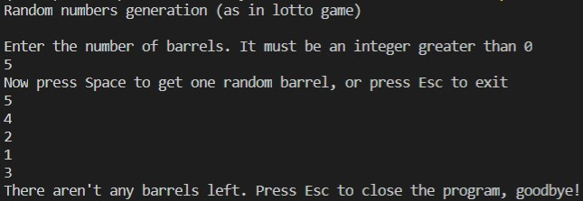

# Lotto random numbers generation

## :mortar_board: About 
This is once again my university assingment. The task was to write a program for drawing lots by generating random numbers as it is in lotto game.

I wanted to try something new and realised that there is a keyboard library in Python. As a result, you can use keyboard keys to manage this program.

Input data is N = number of lotto barrels that you want to get. After pressing Enter you will get one number from the gap (1, N). Numbers are unique so you can get every barrel only one time. To exit the program you should press Esc.



## :computer: Starting
The program is written in Python and works in console. You need to have pipenv installed, because *keyboard* library is used in this project.

Requirements are:
- Python >= 3.6
- Pipenv
- Git

In case you don't have pipenv:
```
$ pip install pipenv
```

Please follow these instructions:
```bash
# clone the repository
$ git clone https://github.com/trynke/lotto.git
# activate the virtual environment
$ pipenv shell
# start the project
$ python lotto.py
# the program works in console
```
